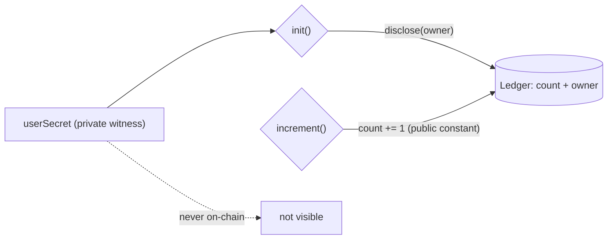

# Nyx — private counter on Midnight

> Seniors prove their offer count. Nobody sees their salary. Numbers you can't inflate.

Midnight Builder Challenge — Level 2 (Frontend Integration). Built on Level 1 counter.

Repo: https://github.com/koushiknoah77/Nyx

## Live Demo

[PASTE LIVE URL AFTER DEPLOYING FRONTEND]

This URL talks to the Preprod contract below. You need Lace wallet on Preprod to click through it. Local dev is `http://localhost:5173`.

## Contract Address

| Network | Address |
|---------|------------------------------------------------------------------|
| Preprod | e15e39e7384dacd94089c6b5350094db636b3a238969d5da1793bfc445779890 |
| Preview | 6880d0b105b2f9610c14c73f9a68e240f08382a9feccdfd26fb23a99da186fa1 |

Preprod was redeployed on 2026-09-08 for the init-guard fix (`initialized` flag — second `init` calls now fail instead of rebinding ownership). Preview still runs the previous build (redeploy blocked by a wallet-SDK shielded-sync failure on Preview; the old Preview address verifies fine against the old code). Deployer wallets live in local `.midnight-state.json`, gitignored, never committed.

## What This Does

Plain version: it's a counter with a secret.

Anyone can read the total. Only the owner can increment it. Nobody watching the chain — or the UI — can see the secret or who the owner is.

Two circuits, that's it:

| Circuit | What happens |
|---------|--------------|
| `init()` | One-time setup. Locks the counter to your secret commitment. |
| `increment()` | Owner-only +1. Moves the public total, hides everything else. |

No constructor args. Deploy runs the implicit constructor, `init` is the first real call.

I built this as the smallest possible version of OfferStats (see Initial Idea below). Same shape: public aggregates, private inputs, proof in the middle. If this counter is honest, the bigger stats machine can be honest too.

The frontend in `src/` is a React + Vite dApp. Connect Lace on Preprod, it reads the public total from the indexer, you click Initialize once then Increment. Proof generates locally in your wallet. Every call is labeled what it is: "Proved without revealing your input."

## Privacy Model

- What is PUBLIC (on-chain, anyone can see it):
  - `count` — the running total. That's the point, the world gets the number.
  - The increment — it's the constant `1`. There is no step input, nothing to hide there. Each call moves the total by exactly one.
  - `owner` — a hash commitment, `persistentHash("campus-counter:owner:v1" || secret)`. Proves *someone* owns it without saying who.
  - `initialized` — one-time-setup flag. Public, boring, and load-bearing: it's what stops a second `init` from rebinding ownership.
- What is PRIVATE (never on-chain, never in the UI):
  - `userSecret()` — the owner's 32-byte secret. Generated in your browser, stored in localStorage, never rendered anywhere.
  - Who called — ownership is a ZK check, not a wallet-address check. The proof doesn't name the caller.
- What the user PROVES without revealing:
  - "I know the secret behind this counter." That's the whole statement. No salary, no identity, no extra metadata.

On the Compact side, `disclose()` appears exactly once, at `init`, for the owner commitment. I tried the obvious thing first — passing a step value and disclosing the new total — and the privacy checker rightfully rejected it. Making the increment a public constant is what makes the design clean: there is simply nothing else to disclose, and the secret is never disclosed.



## Privacy Claim

Watch my Preprod contract on-chain and here's all you get: the running total and an owner commitment sitting in storage. Each transaction moves the total by 1. Full list, nothing else.

What you don't get: the 32-byte secret, or who proved. The commitment shows someone who knows the secret made the call. It never says who.

The UI holds the same line. There is no secret field. There isn't even a step field, because there's no step to enter. Bro, you literally cannot leak your input — there's nowhere to type it.

## Tech Stack

| Layer | What I used |
|-------|-------------|
| Network | Midnight Preprod for the dApp, Preview for L1 history |
| Contract | Compact 0.31.1, language 0.23.0 (`pragma language_version >= 0.23`) |
| Runtime | `@midnight-ntwrk/compact-runtime` 0.16.0 |
| SDK | `@midnight-ntwrk/midnight-js-*` 4.1.1, `@midnight-ntwrk/wallet-sdk` 1.2.0 |
| Proving | `midnightntwrk/proof-server:8.1.0` on port 6300 |
| Frontend | React 19 + Vite 7, Lace via DApp Connector API 4.0.1, proving delegated to wallet |
| Tooling | Node.js v22 in WSL Ubuntu, TypeScript, Vitest |

Stick to the support matrix: https://docs.midnight.network/relnotes/support-matrix. I burned half a day on compiler 0.34 + runtime 0.19 before I learned that lesson. 0.31.1 + 0.16.0 is the pair that actually deploys.

## Prerequisites

Do all of this in **WSL Ubuntu**. PowerShell will waste your time — `compact` up there resolves to Windows disk compression, I'm not kidding.

- Node.js v22: `nvm use 22`. Guide if you need it: https://docs.midnight.network/guides/windows-compact-setup
- Docker + proof server:
```bash
docker run -p 6300:6300 midnightntwrk/proof-server:8.1.0 midnight-proof-server -v
```
- Compact toolchain: `compact update 0.31.1`, verify with `compact compile --version`
- A funded wallet for deploys. Faucets: Preview https://midnight-tmnight-preview.nethermind.dev, Preprod https://midnight-tmnight-preprod.nethermind.dev. My deploy script reuses `MIDNIGHT_WALLET_SEED` if you set it, otherwise it prints an address and waits for you to fund it.
- Lace wallet (Chrome extension), switched to Preprod, for the frontend.

## Setup

```bash
git clone https://github.com/koushiknoah77/Nyx.git
cd Nyx
npm install
npm run compile   # compact compile contracts/counter.compact managed/counter
```

## Run Locally

```bash
git clone https://github.com/koushiknoah77/Nyx.git
cd Nyx
npm install
npm run dev   # http://localhost:5173
```

Then: install Lace, switch it to Preprod, open the app, hit Connect. If proving hangs, check Lace Settings → Midnight section → point it at your local proof server (the docker command above).

## Run Tests

```bash
npm test   # vitest run — 6 tests
```

What they cover: init binds the owner commitment deterministically, a second init fails with `already initialized` (no ownership hijack), increments before init fail with `not initialized`, increments accumulate (3 calls → 3), a wrong secret gets rejected with `not owner`, and raw secret bytes never show up in public state. If any of that breaks, nothing built on top matters.

## Deploy

```bash
# Contracts. First run prints a faucet address and waits for funding.
MIDNIGHT_WALLET_SEED=<funded-seed> npx tsx scripts/deploy-counter.ts --network preview
MIDNIGHT_WALLET_SEED=<funded-seed> npx tsx scripts/deploy-counter.ts --network preprod
```

```bash
# Frontend
npm run dev     # local dev
npm run build   # typecheck + production bundle into dist/
```

Deploy records the address in `.midnight-state.json` (gitignored). Wallet sync lives in `.midnight-wallet-state/` (gitignored). Back that folder up — without it every deploy resyncs from genesis and you'll sit there 10 minutes wondering if it's stuck.

## Project Structure

```text
contracts/counter.compact   # the Compact contract
managed/counter/            # compiler output: contract/ keys/ zkir/ compiler/
scripts/                    # deploy-counter.ts, network.ts, wallet.ts, wallet-state.ts
src/                        # React dApp: App, components/, hooks/, midnight/
index.html                  # Vite entry
vite.config.ts              # WASM + node-polyfill browser config
vercel.json                 # SPA rewrites for hosting
public/zk/counter/          # ZK artifacts served to the browser (keys/, zkir/)
tests/counter.test.ts       # 6 vitest tests
docs/l4-idea.md             # L4 idea submission overview
docs/l2-demo.md             # demo video script (four required shots)
docs/screenshots/           # terminal captures (compile.txt, tests.txt, deploy.txt)
```

## Verify

```bash
npx tsc --noEmit      # must be clean
npm run compile       # must print "Compiling 2 circuits"
npm test              # must print "Tests 6 passed (6)"
npm run build         # typecheck + Vite bundle into dist/
```

Last verified on my machine: tsc clean, 2 circuits, 6/6 tests, 1430 modules built in ~24s. The 500 kB+ chunk warning is normal — ledger WASM is just big.

## Roadmap

| Level | Plan |
|-------|------|
| L2 (done) | Counter + frontend on Preprod: Lace connect, browser circuit calls, local proving |
| L3 | Production-grade: CI passing, idea approved against the problem list |
| L4 | MVP live on Preprod. Track: Consumer & Social. OfferStats writeup in `docs/l4-idea.md` |
| L5 | 50 Preprod users from one placed batch + feedback loop |
| L6 | Mainnet, brand assets, 20 real users |

## Troubleshooting

Stuff I actually hit, so you don't have to:

- `compact: command not found` in PowerShell → wrong shell. Use WSL. `compact` lives at `~/.local/bin/compact` in there.
- `Failed to update / Expecting a file .../compactc` → WSL is missing `unzip`. Install it, delete `~/.compact/versions/<ver>`, re-run `compact update <ver>`, `chmod +x` the binaries.
- `does not contain a function-valued field named userSecret` → contract has witnesses but you deployed with `withVacantWitnesses`. Use `CompiledContract.withWitnesses(...)`.
- `expected instance of ContractMaintenanceAuthority` → compiler/runtime mismatch. Use 0.31.1 + 0.16.0. Check the matrix.
- First sync takes 5+ minutes → normal. Reuse a same-seed `.midnight-wallet-state/<net>/` to skip it.
- Frontend says no wallet → install Lace, refresh the page. It reads `window.midnight`, fresh installs only inject after reload.
- Wrong network → the app tells you what Lace is on. Switch Lace to Preprod, reconnect.
- Proving hangs → Lace needs a reachable prover. Run the local proof server, select Local in Lace Midnight settings.

## Initial Idea

Every admission season my college publishes placement stats that smell wrong. 100% placed, huge medians. Every junior knows someone's cooking the books, but nobody can prove it — because the raw data (who got what) is private and should stay private. So the lie survives because the truth can't be shown.

That's what I'm building OfferStats to kill.

Placed seniors prove their offers count toward honest stats without showing salary. Offer commitment + nullifier means one offer = one count. No double-counting, no invented entries. The chain publishes aggregates only: median CTC, % placed, bracket counts. No names, no exact salaries.

Why students use it: seniors get verified flex (status matters on campus), juniors get real numbers instead of brochure fiction. I'm not selling privacy, privacy is the engine. I'm selling truth and bragging rights.

Why colleges pay: credible placement data is their #1 admission pitch. "Stats nobody can inflate" as Edtech SaaS, not a toy.

First 50 users: one placed batch. Classmates with offers prove, juniors verify. Phones in a classroom, gasless via DUST sponsorship so testers never see a seed phrase or gas fee.

Later the same nullifier-bracket pattern stretches to internships, hackathon wins, any countable credential.

This counter is the seed. Owner-bound increments become one-nullifier-one-count brackets. The ownership proof becomes a CTC-threshold predicate. `count` becomes per-bracket public totals. Small now, honest later.

## Demo Video

[PLACEHOLDER — I will add the link after recording]

Under 2 minutes, four shots: connect Lace and show the address, call the circuit and show local proof generation, show the on-chain result, point out the private input was never shown. Full script: `docs/l2-demo.md`.

## Screenshots

Terminal captures live under `docs/screenshots/`. PNGs go next to them as `compile.png`, `tests.png`, `deploy.png`.

### Compile (`docs/screenshots/compile.txt`)
```text
> nyx-counter@1.0.0 compile
> compact compile contracts/counter.compact managed/counter && node scripts/syncify-managed.mjs managed

Compiling 2 circuits:
syncify-managed: nothing to change
```

### Tests — 6 passing (`docs/screenshots/tests.txt`)
```text
 ✓ tests/counter.test.ts (6 tests)

 Test Files  1 passed (1)
      Tests  6 passed (6)
```

### Deploy — Preprod contract address (`docs/screenshots/deploy.txt`)
```text
Contract Address: e15e39e7384dacd94089c6b5350094db636b3a238969d5da1793bfc445779890
```

### Frontend build (`docs/screenshots/frontend-build.txt`)
```text
1430 modules transformed.
dist/assets/midnight_ledger_wasm_bg-*.wasm   10,143.78 kB
dist/assets/index-*.js                        1,113.33 kB
built in ~30s
```

## Links

- Repo: https://github.com/koushiknoah77/Nyx
- Midnight docs: https://docs.midnight.network
- Support matrix: https://docs.midnight.network/relnotes/support-matrix
- Windows setup: https://docs.midnight.network/guides/windows-compact-setup
- Preview faucet: https://midnight-tmnight-preview.nethermind.dev
- Preprod faucet: https://midnight-tmnight-preprod.nethermind.dev
- Lace wallet: https://chromewebstore.google.com/detail/lace/gafhhkghbfjjkeiendhlofajokpaflmk

## License

MIT — do what you want with it. If you fix my circuits, send a PR.
