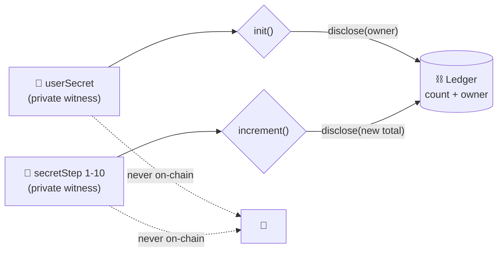

<div align="center">

# 🌑 Nyx

### Privacy-first counter on Midnight.

*Only the owner can increment. The step stays secret. Only the total is ever public.*

[](https://docs.midnight.network)
[](https://docs.midnight.network/compact)
[](https://nodejs.org)
[](tests/counter.test.ts)
[](#-contract-address)
[](LICENSE)

*Midnight Builder Challenge — Level 1 · Setup & First Contract*

</div>

---

## 📍 Contract Address
| Network | Address |
|---------|------------------------------------------------------------------|
| Preview | 6880d0b105b2f9610c14c73f9a68e240f08382a9feccdfd26fb23a99da186fa1 |

> Deployed to Preview on 2026-09-07 from wallet `mn_addr_preview1g9d...aphuue`
> (full address lives in local `.midnight-state.json`, gitignored).

---

## ✨ What This Does

`contracts/counter.compact` keeps a **running total anyone can read**, while the **increments stay private**.

| Circuit | What happens |
|---------|--------------|
| `init()` | One-time setup — binds the counter to the owner's secret commitment |
| `increment()` | Owner-only private step (1–10) — discloses **only the new total** |

No constructor args. Deploy runs the implicit constructor, then `init` is the first circuit call.

---

## 🔐 Privacy Model

- What is PUBLIC (on-chain, visible to anyone):
  - `count` — the running total.
  - `owner` — a hash commitment (`persistentHash("campus-counter:owner:v1" || secret)`) identifying the owner without revealing the secret.
- What is PRIVATE (private witness, never on-chain):
  - `userSecret()` — the owner's 32-byte secret.
  - `secretStep()` — the increment amount (1–10).
- What the user PROVES without revealing:
  - Knowledge of the secret behind the `owner` commitment.
  - That the hidden increment is within 1–10.

`disclose()` is used deliberately in exactly **two** places — the owner commitment at `init` and the new total on each `increment`. Individual steps and secrets are **never** disclosed.



---

## 🛠️ Tech Stack

| Layer | Choice |
|-------|--------|
| Network | Midnight Preview |
| Contract language | Compact 0.31.1 (language 0.23.0, `pragma language_version >= 0.23`) |
| Runtime | `@midnight-ntwrk/compact-runtime` 0.16.0 |
| Framework | `@midnight-ntwrk/midnight-js-*` 4.1.1 · `@midnight-ntwrk/wallet-sdk` 1.2.0 |
| Proving | `midnightntwrk/proof-server:8.1.0` on port 6300 |
| App | Node.js v22 (WSL Ubuntu) · TypeScript · Vitest |

Versions follow the official support matrix: https://docs.midnight.network/relnotes/support-matrix

---

## 📋 Prerequisites

- **WSL Ubuntu + Node.js v22**: `nvm use 22` (Windows PowerShell Node is NOT supported — see https://docs.midnight.network/guides/windows-compact-setup)
- **Docker** with the proof server on port 6300:
```bash
docker run -p 6300:6300 midnightntwrk/proof-server:8.1.0 midnight-proof-server -v
```
- **Compact toolchain**: `compact update 0.31.1`, verify with `compact compile --version`
- **A funded Preview wallet** for deploy (faucet: https://midnight-tmnight-preview.nethermind.dev). The deploy script reuses `MIDNIGHT_WALLET_SEED` if set, otherwise generates one and waits for funding.

---

## 🚀 Setup

```bash
git clone https://github.com/koushiknoah77/Nyx.git
cd Nyx
npm install
npm run compile   # compact compile contracts/counter.compact managed/counter
```

## 🧪 Run Tests

```bash
npm test   # vitest run - 5 tests: circuit logic, state transitions, privacy
```

## 📦 Deploy

```bash
# Preview (needs tNIGHT + DUST; first run prints a faucet address and waits)
MIDNIGHT_WALLET_SEED=<funded-preview-seed> npx tsx scripts/deploy-counter.ts --network preview
```

Records the address in `.midnight-state.json` (gitignored). Wallet sync state lives in `.midnight-wallet-state/` (gitignored).

---

## 📁 Project Structure

```text
contracts/counter.compact   # the Compact contract
managed/counter/            # compiler output: contract/ keys/ zkir/ compiler/
scripts/                    # deploy-counter.ts, network.ts, wallet.ts, wallet-state.ts
tests/counter.test.ts       # 5 vitest tests
docs/screenshots/           # terminal captures (compile.txt, tests.txt, deploy.txt)
```

## ✅ Verify

```bash
npx tsc --noEmit        # typecheck, must be clean
npm run compile         # must print "Compiling 2 circuits"
npm test                # must print "Tests 5 passed (5)"
```

---

<details>
<summary><b>🆘 Troubleshooting</b></summary>

- `compact: command not found` in PowerShell → use WSL Ubuntu, `compact` only exists there (`~/.local/bin/compact`).
- `Failed to update / Expecting a file .../compactc` → install `unzip` in WSL, delete `~/.compact/versions/<ver>`, re-run `compact update <ver>`, `chmod +x` the extracted binaries.
- `does not contain a function-valued field named userSecret` → deploy with `CompiledContract.withWitnesses(...)`, not `withVacantWitnesses` (this contract has witnesses).
- `expected instance of ContractMaintenanceAuthority` → compiler/runtime mismatch. Use the matrix pair: compiler 0.31.1 + runtime 0.16.0 (this repo), not 0.34.0 + 0.19.0.
- Preview sync takes 5+ minutes on first run → copy a same-seed `.midnight-wallet-state/preview/` to resume, or just wait.

</details>

---

## 💡 Initial Idea

**Problem:** campus venues get fined for underage entry, and students hate handing their ID to a stranger at the door. Existing checkers either stare at a birth date (slow, creepy) or store student IDs in a database (a breach waiting to happen).

**Product:** Nyx is tap-to-prove event entry. A student proves "18+" (or "enrolled") in ~10 seconds without showing any ID. The organizer gets a compliance log with zero personal data stored.

**Why students will actually use it:** skip the ID queue, never hand your license to a bouncer, access 18+ zones, plus perks (drink tokens, discounts). Privacy is the engine, not the sales pitch.

**Why organizers pay:** fine avoidance, faster entry, and no breach liability — "we can't leak what we don't hold." Per-event SaaS plus a verification API.

**Getting the first 50 users:** distribution comes through organizers, not app-store downloads. 2-3 campus events mandate or fast-lane Nyx at entry; one 200-person fest converts 25% and L5's 50-tester requirement is done — doubling as our validation cohort. Gasless via DUST sponsorship so testers never touch crypto UX.

**Later:** the same credential extends to exam halls, canteens, and club memberships.

This Level 1 counter is the minimal version of that pattern: `count` and an owner commitment are public, while the secret and each increment (1-10) stay private as witnesses. `init` binds the counter to `ownerOf(secret)` and `increment` proves ownership plus range, disclosing only the new total.

---

## 📸 Screenshots

Terminal captures live under `docs/screenshots/`. To add PNGs: screenshot your own terminal and save as `docs/screenshots/compile.png`, `tests.png`, `deploy.png`.

### Compile (`docs/screenshots/compile.txt`)
```text
> nyx-counter@1.0.0 compile
> compact compile contracts/counter.compact managed/counter && node scripts/syncify-managed.mjs managed

Compiling 2 circuits:
syncify-managed: nothing to change
```

### Tests - 5 passing (`docs/screenshots/tests.txt`)
```text
 ✓ tests/counter.test.ts (5 tests)

 Test Files  1 passed (1)
      Tests  5 passed (5)
```

### Deploy - Preview contract address (`docs/screenshots/deploy.txt`)
```text
Contract Address: 6880d0b105b2f9610c14c73f9a68e240f08382a9feccdfd26fb23a99da186fa1
```

---

## 🔗 Links

| | |
|---|---|
| Repo | https://github.com/koushiknoah77/Nyx |
| Midnight docs | https://docs.midnight.network |
| Support matrix | https://docs.midnight.network/relnotes/support-matrix |
| Windows setup | https://docs.midnight.network/guides/windows-compact-setup |
| Preview faucet | https://midnight-tmnight-preview.nethermind.dev |

## 📄 License

MIT
