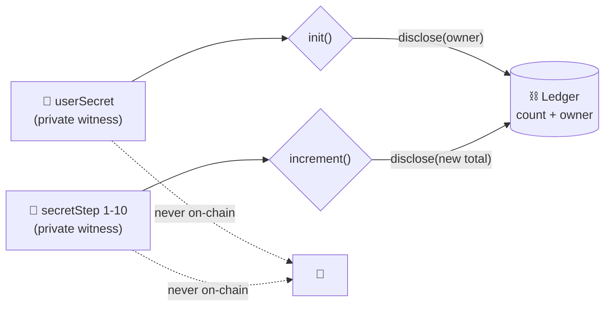

<div align="center">

# 🌑 Nyx

### I got tired of fake placement stats. So I'm putting real ones on-chain.

*Seniors prove their offers count. Nobody sees their salary. The numbers can't be inflated.*

[](https://docs.midnight.network)
[](https://docs.midnight.network/compact)
[](https://nodejs.org)
[](tests/counter.test.ts)
[](src/App.tsx)
[](#-contract-address)
[](LICENSE)

*Midnight Builder Challenge - Level 2 · Frontend Integration*

</div>

---

## 🎬 Live Demo
[PASTE LIVE URL AFTER DEPLOYING FRONTEND]

The live app talks to the Preprod contract below. You will need the Lace wallet
on the Preprod network to click through it.

## 📍 Contract Address
| Network | Address |
|---------|------------------------------------------------------------------|
| Preprod | fd737b5c0f40cdc6fd052a2fbf74fff3e8c24b0ffdf20f19ab6f9b6dcea6b2cc |
| Preview | 6880d0b105b2f9610c14c73f9a68e240f08382a9feccdfd26fb23a99da186fa1 |

> Preprod deployed on 2026-09-08 for the Level 2 frontend. Preview deployed on
> 2026-09-07 for Level 1. Deployer wallets live in local `.midnight-state.json`
> (gitignored).

---

## ✨ What This Does

This is a counter with a secret. Anyone can read the total. Only the owner can move it. And nobody - not me, not you, not someone staring at the chain explorer - can see the individual steps.

I built it as the foundation for OfferStats (see Initial Idea): honest campus placement numbers where seniors prove offers without showing salaries. The counter is the smallest possible version of that machine - public totals, private inputs, proofs in between.

Since Level 2 it has a face. The dApp in `src/` connects your Lace wallet on Preprod, reads the public total straight from the chain, and lets you initialize the counter or increment it with one click. The proof generates locally in your wallet - the secret never leaves your browser, the step is fixed at 1 and never shown anywhere, and every call carries the label it earns: "Proved without revealing your input."

| Circuit | What happens |
|---------|--------------|
| `init()` | One-time setup - locks the counter to the owner's secret commitment |
| `increment()` | Owner-only private step (1-10) - reveals **only the new total** |

No constructor args. Deploy runs the implicit constructor, then `init` is the first circuit call.

Roadmap: L2/L3 grows this into offer-bracket counters with nullifier sets - one offer, one count, no fakes.

---

## 🔐 Privacy Model

- What is PUBLIC (on-chain, visible to anyone):
  - `count` - the running total. This is the whole point: the world gets to see the number.
  - `owner` - a hash commitment (`persistentHash("campus-counter:owner:v1" || secret)`). It says *someone* owns this counter without saying who.
- What is PRIVATE (private witness, never on-chain):
  - `userSecret()` - the owner's 32-byte secret. Lives on their device. Dies with their device.
  - `secretStep()` - the increment amount (1-10). Nobody's business but the owner's.
- What the user PROVES without revealing:
  - "I know the secret behind this counter" - without showing it.
  - "My step is between 1 and 10" - without saying which.

`disclose()` shows up exactly twice in my code, and both times on purpose: the owner commitment at `init`, the new total at `increment`. Everything else stays in the dark. That's the entire philosophy of this project in two lines of code.



---

## 🔒 Privacy Claim

An on-chain observer watching my Preprod contract sees exactly two things: the
running total going up, and an owner commitment sitting in storage. That is the
complete list.

What they can never see: the owner's secret, the step size of any increment, or
which increments belong to whom. The UI upholds the same rule - there is no input
field for secrets anywhere in the app. The step is fixed at 1, created locally,
never typed, never displayed. Every call carries the label it earns:
"Proved without revealing your input."

---

## 🛠️ Tech Stack

| Layer | Choice |
|-------|--------|
| Network | Midnight Preprod (dApp + contract) · Preview (L1 history) |
| Contract language | Compact 0.31.1 (language 0.23.0, `pragma language_version >= 0.23`) |
| Runtime | `@midnight-ntwrk/compact-runtime` 0.16.0 |
| Framework | `@midnight-ntwrk/midnight-js-*` 4.1.1 · `@midnight-ntwrk/wallet-sdk` 1.2.0 |
| Proving | `midnightntwrk/proof-server:8.1.0` on port 6300 |
| Frontend | React 19 + Vite 7 · Lace wallet via DApp Connector API 4.0.1 · proving delegated to wallet |
| App | Node.js v22 (WSL Ubuntu) · TypeScript · Vitest |

Versions follow the official support matrix: https://docs.midnight.network/relnotes/support-matrix - I learned the hard way that anything else breaks the deploy. Ask me about compiler 0.34 sometime. Actually don't.

---

## 📋 Prerequisites

You need three things. All of them run in **WSL Ubuntu** - Windows PowerShell will betray you (my `compact` command resolved to a Windows disk-compression tool; true story).

- **Node.js v22**: `nvm use 22` ([why WSL](https://docs.midnight.network/guides/windows-compact-setup))
- **Docker** with the proof server on port 6300:
```bash
docker run -p 6300:6300 midnightntwrk/proof-server:8.1.0 midnight-proof-server -v
```
- **Compact toolchain**: `compact update 0.31.1`, check with `compact compile --version`
- **A funded Preview wallet** for deploy (faucet: https://midnight-tmnight-preview.nethermind.dev). My deploy script reuses `MIDNIGHT_WALLET_SEED` if you set it, otherwise it makes you a wallet and waits while you fund it.
- **Lace wallet** (Chrome extension) for the frontend demo, switched to the Preprod network.

---

## 🚀 Setup

```bash
git clone https://github.com/koushiknoah77/Nyx.git
cd Nyx
npm install
npm run compile   # compact compile contracts/counter.compact managed/counter
```

## 🏃 Run Locally

```bash
git clone https://github.com/koushiknoah77/Nyx.git
cd Nyx
npm install
npm run dev   # Vite at http://localhost:5173
```

Then install the Lace wallet extension, switch it to Preprod, open the app and
connect. For local proving, point Lace at a local proof server (Lace Settings,
Midnight section) with Docker running:
`docker run -p 6300:6300 midnightntwrk/proof-server:8.1.0 midnight-proof-server -v`.

## 🧪 Run Tests

```bash
npm test   # vitest run - 5 tests: circuit logic, state transitions, privacy
```

Five tests, all green: init binds the owner, increments accumulate (3+10+1=14), strangers get rejected, out-of-range steps get rejected, and raw secrets never appear in public state. If any of that breaks, nothing else I build on top matters.

## 📦 Deploy

```bash
# Contracts (Preview for L1, Preprod for L2 - first run prints a faucet address and waits)
MIDNIGHT_WALLET_SEED=<funded-seed> npx tsx scripts/deploy-counter.ts --network preview
MIDNIGHT_WALLET_SEED=<funded-seed> npx tsx scripts/deploy-counter.ts --network preprod
```

```bash
# Frontend
npm run dev       # Vite at http://localhost:5173
npm run build     # typecheck + production bundle into dist/
```

Records the address in `.midnight-state.json` (gitignored). Wallet sync state lives in `.midnight-wallet-state/` (gitignored). Pro tip I wish someone gave me: back up `.midnight-wallet-state` - without it every deploy re-syncs from genesis and you'll watch paint dry for 10 minutes.

---

## 📁 Project Structure

```text
contracts/counter.compact   # the Compact contract
managed/counter/            # compiler output: contract/ keys/ zkir/ compiler/
scripts/                    # deploy-counter.ts, network.ts, wallet.ts, wallet-state.ts
src/                        # React dApp: App, components/, hooks/, midnight/
index.html                  # Vite entry
vite.config.ts              # WASM + node-polyfill browser config
vercel.json                 # SPA rewrites for hosting
public/zk/counter/          # ZK artifacts served to the browser (keys/, zkir/)
tests/counter.test.ts       # 5 vitest tests
docs/l4-idea.md             # L4 idea submission overview (track + mapping)
docs/l2-demo.md             # demo video script (four required shots)
docs/screenshots/           # terminal captures (compile.txt, tests.txt, deploy.txt)
```

## ✅ Verify

```bash
npx tsc --noEmit        # typecheck, must be clean
npm run compile         # must print "Compiling 2 circuits"
npm test                # must print "Tests 5 passed (5)"
npm run build           # typecheck + Vite bundle into dist/
```

## 🗺️ Roadmap

Where I'm taking this, level by level:

| Level | Plan |
|-------|------|
| L2 (done) | Counter frontend on Preprod: Lace connect, browser circuit calls, local proving |
| L3 | Production-grade: tests, CI/CD, idea approved against the problem list |
| L4 | MVP live on Preprod. Track: Consumer & Social. Builds on Age / Eligibility Gate + Confidential Credentials (full writeup: `docs/l4-idea.md`) |
| L5 | 50 Preprod users from one placed batch + a living feedback loop |
| L6 | Mainnet deploy, brand assets, 20 real users |

---

<details>
<summary><b>🆘 Troubleshooting (scars I earned so you don't have to)</b></summary>

- `compact: command not found` in PowerShell → you're in the wrong shell. WSL Ubuntu. `compact` only lives at `~/.local/bin/compact` in there.
- `Failed to update / Expecting a file .../compactc` → WSL is missing `unzip`, so the toolchain download never extracts. Install unzip, delete `~/.compact/versions/<ver>`, re-run `compact update <ver>`, `chmod +x` the binaries.
- `does not contain a function-valued field named userSecret` → I hit this because my contract HAS witnesses and I deployed with `withVacantWitnesses`. Use `CompiledContract.withWitnesses(...)` with dummy witnesses for deploy.
- `expected instance of ContractMaintenanceAuthority` → your compiler and runtime are from different eras. The pair that works: compiler 0.31.1 + runtime 0.16.0. Not 0.34.0 + 0.19.0. The support matrix is law.
- Preview sync takes 5+ minutes on first run → normal. Copy a same-seed `.midnight-wallet-state/preview/` over to resume instantly, or make tea.
- Frontend says no wallet found → install Lace, enable it, refresh. It reads wallets from `window.midnight`, and a fresh install only injects after a reload.
- Wallet is on the wrong network → the app tells you which one Lace is on. Switch Lace to Preprod and reconnect.
- Proving hangs in the browser → Lace must point at a reachable prover. For the demo I run the local proof server on 6300 and select Local in Lace Settings, Midnight section.
- Vite warns about 500 kB+ chunks → expected. The ledger WASM bundles are megabytes by nature; the warning is noise.

</details>

---

## 💡 Initial Idea

Let me tell you what I actually saw. Every admission season, colleges publish placement stats that smell wrong - 100% placed, sky-high medians - and every junior on campus knows someone's cooking the books. Nobody can prove it, because the raw data (who got what offer) is private and should stay private. So the lie survives on the fact that the truth can't be shown.

That's the thing I'm building OfferStats to kill.

Here's the idea: placed seniors prove their offers count toward honest stats without anyone seeing their salary. An offer-letter commitment plus a nullifier means one offer = one count - no double-counting, no invented entries. The chain publishes only aggregates: median CTC, % placed, bracket counts. No names. No exact salaries. Nothing to inflate, because every number traces back to a proof.

Why will students actually touch it? Seniors get to flex verified placements (status is a hell of a drug), juniors finally get true numbers instead of brochure fiction. I'm not selling privacy - privacy is the engine. I'm selling truth and bragging rights.

Why will colleges pay? Credible placement data is their #1 admission marketing. My pitch to them: "stats nobody can inflate." Edtech SaaS, not a toy.

My first 50 users are one placed batch. Classmates with offers prove, juniors verify - phones in a classroom, gasless through DUST sponsorship so no tester ever sees a seed phrase or a gas fee. No venue deals. No door hardware. Just people who already care.

Later, the same nullifier-bracket pattern stretches to internships, hackathon wins, any countable credential.

And this Level 1 counter? It's the seed of all that. Owner-bound increments become one-nullifier-one-count offer brackets. The 1-10 range proof becomes a CTC-threshold predicate. `count` becomes per-bracket public totals. Small now, honest later.

---

## 🎥 Demo Video
[PLACEHOLDER - I will add the link after recording]

Planned shots (under 2 minutes): connect Lace and show the address, call the
circuit and show local proof generation, show the on-chain result, point out the
private input was never shown. Full script: `docs/l2-demo.md`.

## 📸 Screenshots

Terminal captures live under `docs/screenshots/`. To add PNGs: screenshot your own terminal and save as `docs/screenshots/compile.png`, `tests.png`, `deploy.png`.

### Compile (`docs/screenshots/compile.txt`)
```text
> nyx-counter@1.0.0 compile
> compact compile contracts/counter.compact managed/counter && node scripts/syncify-managed.mjs managed

Compiling 2 circuits:
syncify-managed: nothing to change
```

### Tests - 5 passing (`docs/screenshots/tests.txt`)
```text
 ✓ tests/counter.test.ts (5 tests)

 Test Files  1 passed (1)
      Tests  5 passed (5)
```

### Deploy - Preview contract address (`docs/screenshots/deploy.txt`)
```text
Contract Address: 6880d0b105b2f9610c14c73f9a68e240f08382a9feccdfd26fb23a99da186fa1
```

### Frontend build (`docs/screenshots/frontend-build.txt`)
```text
1430 modules transformed.
dist/assets/midnight_ledger_wasm_bg-*.wasm   10,143.78 kB
dist/assets/index-*.js                        1,113.33 kB
built in ~30s
```

---

## 🔗 Links

| | |
|---|---|
| Repo | https://github.com/koushiknoah77/Nyx |
| Midnight docs | https://docs.midnight.network |
| Support matrix | https://docs.midnight.network/relnotes/support-matrix |
| Windows setup | https://docs.midnight.network/guides/windows-compact-setup |
| Preview faucet | https://midnight-tmnight-preview.nethermind.dev |
| Preprod faucet | https://midnight-tmnight-preprod.nethermind.dev |
| Lace wallet | https://chromewebstore.google.com/detail/lace/gafhhkghbfjjkeiendhlofajokpaflmk |

## 📄 License

MIT - do what you want with it. If you fix my circuits, send a PR.
