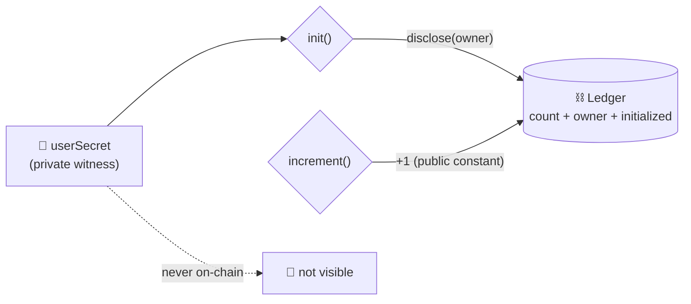
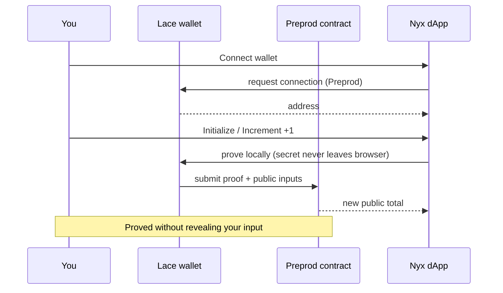

<div align="center">


*Midnight Builder Challenge — Level 2 · Frontend Integration*

<p>
  
  
  
  
  
  
</p>

<a href="#-live-demo">Live Demo</a> ·
<a href="#-contract-address">Contract</a> ·
<a href="#-privacy-model">Privacy</a> ·
<a href="#-run-locally">Run it</a> ·
<a href="#-demo-video">Video</a>

</div>

---

## Contents

- [Live Demo](#-live-demo) · [Contract Address](#-contract-address) · [What This Does](#-what-this-does)
- [Privacy Model](#-privacy-model) · [Privacy Claim](#-privacy-claim) · [Tech Stack](#%EF%B8%8F-tech-stack)
- [Prerequisites](#-prerequisites) · [Setup](#-setup) · [Run Locally](#-run-locally) · [Run Tests](#-run-tests) · [Deploy](#-deploy)
- [Project Structure](#-project-structure) · [Verify](#-verify) · [Roadmap](#%EF%B8%8F-roadmap) · [Troubleshooting](#-troubleshooting)
- [Initial Idea](#-initial-idea) · [Demo Video](#-demo-video) · [Screenshots](#-screenshots) · [Links](#-links) · [License](#-license)

## 🎬 Live Demo

> [PASTE LIVE URL AFTER `vercel --prod` — e.g. `https://nyx-yourname.vercel.app`]

The live app talks to the Preprod contract below. **No wallet needed to view:**
the landing state reads the live on-chain total straight from the Preprod indexer,
so judges always see a populated demo (count, initialized flag, owner commitment).
You need the **Lace wallet on Preprod** only to transact (initialize / increment).
Local dev runs at `http://localhost:5173`.

Deploy (Vercel, already configured via `vercel.json` SPA rewrites):
```bash
npm i -g vercel; vercel login; vercel --prod
# then replace the placeholder above with the production URL
```
Pre-deploy check: `npm run build` must succeed and `dist/zk/counter/` must contain
the ZK artifacts (copied from `public/zk/counter/`). See [`docs/l2-sdk-note.md`](docs/l2-sdk-note.md)
for the provider-to-package mapping judges look for.

## 📍 Contract Address

| Network | Address |
|---------|------------------------------------------------------------------|
| Preprod | `e15e39e7384dacd94089c6b5350094db636b3a238969d5da1793bfc445779890` |
| Preview | `6880d0b105b2f9610c14c73f9a68e240f08382a9feccdfd26fb23a99da186fa1` |

> [!NOTE]
> Preprod was redeployed on 2026-09-08 for the init-guard fix (`initialized` flag — repeat `init` calls now fail instead of rebinding ownership). Preview still runs the previous build (its redeploy is blocked by a wallet-SDK shielded-sync failure on Preview; the old Preview address verifies fine against the old code). Deployer wallets live in local `.midnight-state.json` — gitignored, never committed.

## ✨ What This Does

A counter with a secret. Anyone can read the total. Only the owner can move it. Nobody watching the chain — or the UI — can see the secret or who the owner is.



Two circuits, that's it:

| Circuit | What happens |
|---------|--------------|
| `init()` | One-time setup. Locks the counter to your secret commitment, flips the `initialized` flag. A second call fails — no ownership hijack. |
| `increment()` | Owner-only +1. Moves the public total, hides everything else. Fails before init with `not initialized`. |

No constructor args. Deploy runs the implicit constructor, `init` is the first real call. The full call flow looks like this:



I built this as the smallest possible version of OfferStats (see [Initial Idea](#-initial-idea)). Same shape: public aggregates, private inputs, proof in the middle. If this counter is honest, the bigger stats machine can be honest too.

## 📊 OfferStats Tab (L4 MVP — UI done, contract deploy pending)

The app has a second tab, **OfferStats**: the pilot-batch stats board from the vision above.

- **Public dashboard** (no wallet): per-bracket counts with bars, offers counted / 32 slots, % placed, median bracket, nullifiers used. Aggregates only — exact salaries can never appear here by construction.
- **Placement cell** (Lace): `init(batchSize)` opens counting for one batch (max 32).
- **Senior** (Lace): type your exact CTC → the app derives your public bracket, proves the salary falls in it, and counts one offer. The figure lives in memory only and is cleared after proving; your per-browser offer secret never renders anywhere.

Status: contract written + 8/8 circuit tests green, UI + 6 helper tests green, browser ZK artifacts shipped (`public/zk/offerstats/`). **Not yet deployed** — deploy, paste the address, rebuild:

```bash
MIDNIGHT_WALLET_SEED=<funded-seed> npm run deploy:offerstats -- --network preprod
# paste contracts["offerstats:preprod"] into src/config.ts OFFERSTATS_CONTRACT_ADDRESS
npm run build   # then redeploy the frontend
```

Until then the tab honestly renders "Not deployed yet" and the Counter tab is unaffected.

## 🔐 Privacy Model

- What is PUBLIC (on-chain, anyone can see it):
  - `count` — the running total. That's the point, the world gets the number.
  - The increment — the constant `1`. No step input, nothing to hide. Each call moves the total by exactly one.
  - `owner` — a hash commitment, `persistentHash("campus-counter:owner:v1" || secret)`. Proves *someone* owns it without saying who.
  - `initialized` — one-time-setup flag. Public, boring, load-bearing: it's what stops a second `init` from rebinding ownership.
- What is PRIVATE (never on-chain, never in the UI):
  - `userSecret()` — the owner's 32-byte secret. Generated in your browser, stored in localStorage, never rendered anywhere.
  - Who called — ownership is a ZK check, not a wallet-address check. The proof doesn't name the caller.
- What the user PROVES without revealing:
  - *"I know the secret behind this counter."* No salary, no identity, no extra metadata.

`disclose()` appears exactly once, at `init`, for the owner commitment. The increment is a public constant, so there is nothing else to disclose — and the secret itself is never disclosed.

## 🔒 Privacy Claim

> [!IMPORTANT]
> An on-chain observer sees **exactly three things**: the running total, an owner commitment, and a setup flag. Each transaction moves the total by 1. Full list, nothing else.

What they can never see: the 32-byte secret, or who proved. The commitment shows *someone* who knows the secret made the call. It never says who. The UI holds the same line — there is no secret field, not even a step field, because there's no step to enter. You literally cannot leak your input; there's nowhere to type it.

## 🛠️ Tech Stack

<p align="center">
  
</p>

| Layer | Choice |
|-------|--------|
| Network | Midnight Preprod (dApp + contract) · Preview (L1 history) |
| Contract language | Compact 0.31.1 · language 0.23.0 (`pragma language_version >= 0.23`) |
| Runtime | `@midnight-ntwrk/compact-runtime` 0.16.0 |
| Framework | `@midnight-ntwrk/midnight-js-*` 4.1.1 · `@midnight-ntwrk/wallet-sdk` 1.2.0 |
| Proving | `midnightntwrk/proof-server:8.1.0` on port 6300 |
| Frontend | React 19 + Vite 7 · Lace via DApp Connector API 4.0.1 · proving delegated to wallet |
| App | Node.js v22 (WSL Ubuntu) · TypeScript · Vitest |

> Judge note: `@midnight-ntwrk/midnight-js-network-provider` does not exist on npm
> (404). In midnight-js 4.x its role is split across `indexer-public-data-provider`
> (reads), `level-private-state-provider`, `fetch-zk-config-provider`, and
> `dapp-connector-proof-provider` — all wired in [`src/midnight/providers.ts`](src/midnight/providers.ts).
> Full keyword → file mapping: [`docs/l2-sdk-note.md`](docs/l2-sdk-note.md).

Versions follow the [support matrix](https://docs.midnight.network/relnotes/support-matrix). I burned half a day on compiler 0.34 + runtime 0.19 before learning that lesson — 0.31.1 + 0.16.0 is the pair that actually deploys.

## 📋 Prerequisites

> [!WARNING]
> Do all of this in **WSL Ubuntu**. PowerShell will waste your time — `compact` up there resolves to Windows disk compression. True story.

- **Node.js v22** — `nvm use 22` ([why WSL](https://docs.midnight.network/guides/windows-compact-setup))
- **Docker** + proof server:
```bash
docker run -p 6300:6300 midnightntwrk/proof-server:8.1.0 midnight-proof-server -v
```
- **Compact toolchain** — `compact update 0.31.1`, verify with `compact compile --version`
- **Funded wallet** for deploys — Preview faucet: https://midnight-tmnight-preview.nethermind.dev · Preprod faucet: https://midnight-tmnight-preprod.nethermind.dev. The deploy script reuses `MIDNIGHT_WALLET_SEED` if set, otherwise prints an address and waits for funding.
- **Lace wallet** (Chrome extension), switched to Preprod, for the frontend.

## 🚀 Setup

```bash
git clone https://github.com/koushiknoah77/Nyx.git
cd Nyx
npm install
npm run compile   # compact compile contracts/counter.compact managed/counter
```

## 🏃 Run Locally

```bash
git clone https://github.com/koushiknoah77/Nyx.git
cd Nyx
npm install
npm run dev   # http://localhost:5173
```

Then install Lace, switch it to Preprod, open the app, hit Connect. If proving hangs, point Lace at your local proof server (Lace Settings → Midnight section → Local, port 6300).

## 🧪 Run Tests

```bash
npm test   # vitest run — 21 tests (6 counter + 8 offerstats circuit + 7 UI helpers)
```

| # | Test | Guards |
|---|------|--------|
| 1 | Init binds the owner commitment | deterministic binding |
| 2 | Second init fails | `already initialized` — no hijack |
| 3 | Increment before init fails | `not initialized` |
| 4 | Increments accumulate (3 calls → 3) | constant-+1 design |
| 5 | Wrong secret rejected | `not owner` |
| 6 | Raw secrets never in public state | privacy |

If any of that breaks, nothing built on top matters.

## 📦 Deploy

```bash
# Contracts — first run prints a faucet address and waits for funding
MIDNIGHT_WALLET_SEED=<funded-seed> npx tsx scripts/deploy-counter.ts --network preview
MIDNIGHT_WALLET_SEED=<funded-seed> npx tsx scripts/deploy-counter.ts --network preprod
# OfferStats (L4): same flow, records under contracts["offerstats:<network>"]
MIDNIGHT_WALLET_SEED=<funded-seed> npm run deploy:offerstats -- --network preprod
```

```bash
# Frontend
npm run dev     # local dev
npm run build   # typecheck + production bundle into dist/
```

Deploy records the address in `.midnight-state.json` (gitignored). Wallet sync lives in `.midnight-wallet-state/` (gitignored) — back it up, or every deploy resyncs from genesis and you'll watch paint dry for 10 minutes.

## 📁 Project Structure

```text
contracts/counter.compact   # the Compact contract
contracts/offerstats.compact  # OfferStats v1: 4 brackets, 32-slot nullifier set
managed/counter/ · managed/offerstats/  # compiler output (contract/ keys/ zkir/)
scripts/                    # deploy-counter.ts, deploy-offerstats.ts, network.ts, wallet.ts, wallet-state.ts
src/                        # React dApp: App (page router), components/site/ (product pages), hooks/, midnight/
src/components/site/        # Navbar (wallet) · Footer · Home/About/How/Students/Colleges/Stats/Join pages · PhoneMock · Faq
src/components/offerstats/  # CounterView (dev playground) · VerifiedBadge credential
src/components/PublicCounter.tsx  # read-only Preprod view (no wallet — fixes empty demo)
src/components/OfferStatsDashboard.tsx  # public aggregates board (bars, % placed, median)
src/components/OfferStatsTransact.tsx   # batch init + private-CTC record flow
src/hooks/usePublicCounter.ts · useOfferStatsPublic.ts  # wallet-free indexer polls
src/midnight/offerstats.ts  # witnesses, readers, circuit calls, bracket helpers
index.html                  # Vite entry (favicon + OG meta)
vite.config.ts              # WASM + node-polyfill browser config
vercel.json                 # SPA rewrites for hosting
public/zk/counter/ · public/zk/offerstats/  # ZK artifacts served to the browser
public/favicon.svg          # Nyx moon-N mark
tests/counter.test.ts (6) · tests/offerstats.test.ts (8) · tests/offerstats-ui.test.ts (7)
docs/l4-idea.md             # L4 idea submission overview
docs/l2-demo.md             # demo video script (four required shots)
docs/l2-sdk-note.md         # provider → npm package mapping for judges
docs/DEPLOY-CHECKLIST.md    # live-deploy + resubmit steps
docs/screenshots/           # terminal captures (compile.txt, tests.txt, deploy.txt)
```

## ✅ Verify

```bash
npx tsc --noEmit      # must be clean
npm run judge         # L2 rubric self-check — must print "All judge checks passed."
npm run compile       # must print "Compiling 2 circuits"
npm test              # must print "Tests 21 passed (21)"
npm run build         # typecheck + Vite bundle into dist/
```

Last verified: tsc clean · 2 circuits · 21/21 tests · 1447 modules in ~8s. The 500 kB+ chunk warning is normal — ledger WASM is just big.

## 🗺️ Roadmap

| Level | Status | Plan |
|-------|--------|------|
| L1 | ✅ done | Counter on Preview: compile, tests, deploy |
| L2 | ✅ done | Frontend on Preprod: Lace connect, browser circuit calls, local proving |
| OfferStats product | ✅ UI done, contract deploy pending | 5-bracket contract (recompiled 0.31.1, fresh ZK) + 8/8 circuit tests · full site (Home/About/How/Students/Colleges/Stats+FAQ/Join) with Lace in the navbar and live chain reads · Counter preserved as dev playground ([proposal](PROPOSAL.md), [idea](docs/l4-idea.md)) |
| L3 | 🔄 next | Production-grade: CI passing, idea approved against the problem list |
| L4 | 📝 planned | MVP live on Preprod · Track: Consumer & Social ([writeup](docs/l4-idea.md)) |
| L5 | 📝 planned | 50 Preprod users from one placed batch + feedback loop |
| L6 | 📝 planned | Mainnet, brand assets, 20 real users |

## 🆘 Troubleshooting

<details>
<summary><b>Scars I earned so you don't have to (click to open)</b></summary>

- `compact: command not found` in PowerShell → wrong shell. Use WSL — `compact` lives at `~/.local/bin/compact` there.
- `Failed to update / Expecting a file .../compactc` → WSL is missing `unzip`. Install it, delete `~/.compact/versions/<ver>`, re-run `compact update <ver>`, `chmod +x` the binaries.
- `does not contain a function-valued field named userSecret` → contract has witnesses but you deployed with `withVacantWitnesses`. Use `CompiledContract.withWitnesses(...)`.
- `expected instance of ContractMaintenanceAuthority` → compiler/runtime mismatch. Use 0.31.1 + 0.16.0. The matrix is law.
- First sync takes 5+ minutes → normal. Reuse a same-seed `.midnight-wallet-state/<net>/` to skip it.
- Frontend says no wallet → install Lace, refresh. It reads `window.midnight`; fresh installs only inject after reload.
- Wrong network → the app tells you what Lace is on. Switch to Preprod, reconnect.
- Proving hangs → Lace needs a reachable prover. Local proof server on 6300 + Local selected in Lace Midnight settings.
- `already initialized` → counter is bound to another browser's secret. Use the browser that initialized it, or deploy fresh.
- `not owner` → this browser's secret isn't the initializer's. Same fix as above.

</details>

## 💡 Initial Idea

Every admission season my college publishes placement stats that smell wrong. 100% placed, huge medians. Every junior knows someone's cooking the books, but nobody can prove it — because the raw data (who got what) is private and *should stay private*. So the lie survives because the truth can't be shown.

That's what I'm building OfferStats to kill.

Placed seniors prove their offers count toward honest stats without showing salary. Offer commitment + nullifier means one offer = one count. No double-counting, no invented entries. The chain publishes aggregates only: median CTC, % placed, bracket counts. No names, no exact salaries.

Why students use it: seniors get verified flex (status matters on campus), juniors get real numbers instead of brochure fiction. I'm not selling privacy — privacy is the engine. I'm selling truth and bragging rights.

Why colleges pay: credible placement data is their #1 admission pitch. "Stats nobody can inflate" as Edtech SaaS, not a toy.

First 50 users: one placed batch. Classmates with offers prove, juniors verify. Phones in a classroom, gasless via DUST sponsorship so testers never see a seed phrase or gas fee.

Later the same nullifier-bracket pattern stretches to internships, hackathon wins, any countable credential.

This counter is the seed. Owner-bound increments become one-nullifier-one-count brackets. The ownership proof becomes a CTC-threshold predicate. `count` becomes per-bracket public totals. Small now, honest later.

## 🎥 Demo Video

> [PLACEHOLDER — link after recording]

Under 2 minutes, four shots: connect Lace and show the address → call the circuit and show local proof generation → show the on-chain result → point out the private input was never shown. Full script: [`docs/l2-demo.md`](docs/l2-demo.md). L3 needs a separate 1-minute cut (dApp flow + tests + CI badge): [`docs/l3-demo.md`](docs/l3-demo.md).

Recording checklist: open the **live URL** (not localhost) so judges see the deployed build;
start disconnected to show the public total loads with no wallet; then connect,
increment, show the tx id + refreshed total; end on the Privacy panel
("Proved without revealing your input"). Never open localStorage devtools on camera.

## 📸 Screenshots

Terminal captures live under [`docs/screenshots/`](docs/screenshots/). PNGs go next to them as `compile.png`, `tests.png`, `deploy.png`.
UI captures to add after `vercel --prod`: `ui-disconnected.png` (public total, no wallet),
`ui-connected.png` (address + circuits), `ui-proving.png` (local-proving spinner),
`ui-incremented.png` (new total + tx id).

<details>
<summary><b>Compile (<code>docs/screenshots/compile.txt</code>)</b></summary>

```text
> nyx-counter@1.0.0 compile
> compact compile contracts/counter.compact managed/counter && node scripts/syncify-managed.mjs managed

Compiling 2 circuits:
syncify-managed: nothing to change
```

</details>

<details>
<summary><b>Tests — 6 passing (<code>docs/screenshots/tests.txt</code>)</b></summary>

```text
 ✓ tests/counter.test.ts (6 tests)

 Test Files  1 passed (1)
      Tests  6 passed (6)
```

</details>

<details>
<summary><b>Deploy — Preprod contract address (<code>docs/screenshots/deploy.txt</code>)</b></summary>

```text
Contract Address: e15e39e7384dacd94089c6b5350094db636b3a238969d5da1793bfc445779890
```

</details>

<details>
<summary><b>Frontend build (<code>docs/screenshots/frontend-build.txt</code>)</b></summary>

```text
1430 modules transformed.
dist/assets/midnight_ledger_wasm_bg-*.wasm   10,143.78 kB
dist/assets/index-*.js                        1,113.33 kB
built in ~30s
```

</details>

## 🔗 Links

| | |
|---|---|
| Repo | https://github.com/koushiknoah77/Nyx |
| Midnight docs | https://docs.midnight.network |
| Support matrix | https://docs.midnight.network/relnotes/support-matrix |
| Windows setup | https://docs.midnight.network/guides/windows-compact-setup |
| Preview faucet | https://midnight-tmnight-preview.nethermind.dev |
| Preprod faucet | https://midnight-tmnight-preprod.nethermind.dev |
| Lace wallet | https://chromewebstore.google.com/detail/lace/gafhhkghbfjjkeiendhlofajokpaflmk |

## 📄 License

MIT — do what you want with it. If you fix my circuits, send a PR.

<div align="center">


*count publicly · prove privately · Nyx* 🌑

</div>
